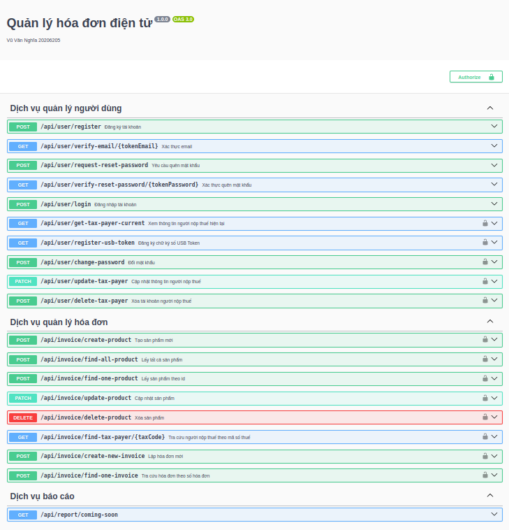

# Bài toán: Ứng dụng quản lý hóa đơn điện tử

- Quản lý người nộp thuế

  - Đăng ký, Đăng nhập tài khoản
  - Xác thực email
  - Yêu cầu quên mật khẩu
  - Đăng ký chữ ký số (Demo Xác thực mã QR)

- Quản lý hóa đơn điện tử (CRUD)

# Kỹ Thuật

- Kiến trúc Microservices
- Domain Driven Design (DDD)
- Hexagonal Architecture
- Sử dụng Design Patterns: Adapter, Builder
- NestJS: Web framework ngôn ngữ TypeScript
- Swagger: Làm việc với API
- JWT: Mã hóa và xác thực
- MySQL và phpMyAdmin: Quản lý CSDL
- NATS Message Broker: Truyền tin nhắn giữa các services
- Mailhog: Máy chủ SMTP gửi email trên localhost
- Docker: Đóng gói và triển khai ứng dụng

# Cách sử dụng

_Để có thể chạy dự án này, bạn sẽ cần cài đặt Docker_

Tải xuống bản sao của kho lưu trữ:

```bash
git clone https://github.com/whynotnghiavu/nghia-einvoice-system.git
```

Điều hướng đến `docker-compose.yml`:

```bash
cd contents/code/docker
```

Tạo và khởi động container:

```bash
docker-compose -f "docker-compose.yml" up -d --build
```

Sau khi khởi động, truy cập qua địa chỉ:

- MySQL: http://localhost:8080
- Mailhog: http://localhost:8025
- API swagger: http://localhost:3001/swagger

# Ảnh chụp màn hình API swagger


